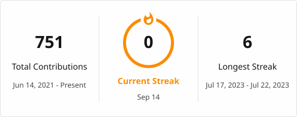

<h1>
  Hello! 
  
  I'm Abner Almeida.
</h1>

<h3>👨🏽‍💻 Software Engineering Student at PUC Minas</h3>

💻 I think that text is <em>misaligned</em>... I'm a perfectionist!

🧠 Looking forward to learning and improving every day!

🎮 I love games, movies and music.

  I am a 19-year-old Software Engineering student at PUC Minas, 
  focused primarily on front-end development.

  I'm looking for an opportunity where I can grow professionally, 
  demonstrate my technical and personal skills, and contribute to 
  the company's development.

  

<h3>Connect with me</h3>

  

  

<h2>My Skills</h2>

  
  
  
  
  
  
  
  
  
  
  
  
  
  
  
  
  
  
  
  
  

 

<h2>My Stats</h2>

<picture>
  <source
    media="(prefers-color-scheme: dark)"
    srcset="./profile/streak-dark.svg"
  />

  <source
    media="(prefers-color-scheme: light)"
    srcset="./profile/streak-light.svg"
  />

  
</picture>

  

<picture>
  <source
    media="(prefers-color-scheme: dark)"
    srcset="https://github-readme-activity-graph.vercel.app/graph?username=abneralmeidacord&theme=vue"
  />
  <source
    media="(prefers-color-scheme: light)"
    srcset="https://github-readme-activity-graph.vercel.app/graph?username=abneralmeidacord&theme=github-light"
  />
  
</picture>

  

<h2>Pac-Man Contribution Graph</h2>

<picture>
  <source
    media="(prefers-color-scheme: dark)"
    srcset="https://raw.githubusercontent.com/abneralmeidacord/abneralmeidacord/output/pacman-contribution-graph-dark.svg"
  />

  <source
    media="(prefers-color-scheme: light)"
    srcset="https://raw.githubusercontent.com/abneralmeidacord/abneralmeidacord/output/pacman-contribution-graph.svg"
  />

  
</picture>

